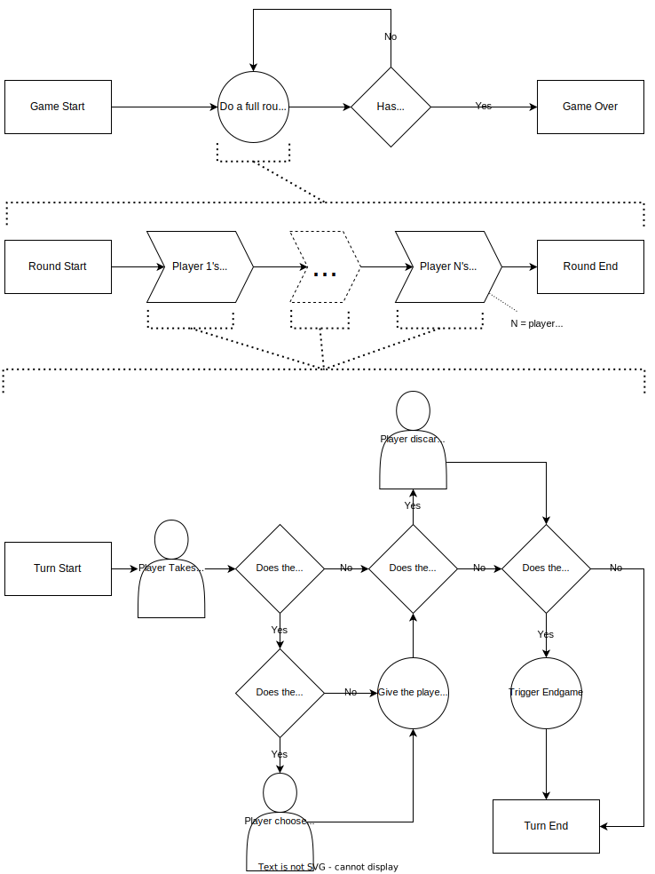

# Splendor

An online clone of my favorite board game. I'm building it to exercise my full-stack skills.

## Specifications

### Game State Flow

### At Game Start

There are three decks of cards, separated by level.

There are four cards revealed from each deck.

The number of nobles revealed equals the player count plus one.

There are 5 Gold tokens.

In a 4-player game, there are 7 of each non-Gold color of token.

In a 3-player game, there are 5 of each non-Gold color of token.

In a 2-player game, there are 4 of each non-Gold color of token.

### On a Player's Turn

The player must take one of the following actions:
- Take 3 tokens, each of a different color.
- Take 2 tokens, both of the same color.
- Buy a card.
- Reserve a card.

When taking three tokens,